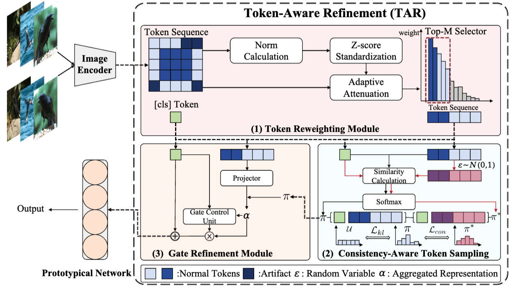

<h1 align="center">TAR</h1>

<p align="center">
Official implementation of our CVPR 2026 paper  <b>"TAR: Token-Aware Refinement for Fine-grained Generalized Category Discovery"</b>
</p>
<p align="center">
  <a href="https://arxiv.org/abs/XXXX">
    
  </a>
  <a href="LICENSE.txt">
    
  </a>
</p>


<p align="center">
  
</p>

## 📖 Introduction

This repository contains the official PyTorch implementation of  **TAR: Token-Aware Refinement for Fine-grained Generalized Category Discovery**.

Our work focuses on fine-grained generalized category discovery and addresses attention artifacts that hinder models from capturing discriminative fine-grained information.

Key Contributions:

- 🚀 We reveal a previously overlooked challenge in **Fine-grained Generalized Category Discovery**, namely the attention artifact problem that hinders models from capturing discriminative fine-grained information.

- 🧠 We propose a **plug-and-play method** that can be easily integrated into existing models without modifying their architectures.

- 📊 Extensive experiments on multiple fine-grained benchmarks (e.g., **CUB**, **FGVC-Aircraft**, and **Stanford Cars**) demonstrate consistent and significant performance improvements.

## 📁 Project Structure
```
TAR/
│
├── clip/               # CLIP Model
├── scripts/            # training scripts
├── data/               # datasets
├── dataset_class_name/ # Generated data
├── util/               # functions
│
├── model.py            # Implementation of TAR
├── config.py           # Configuration file
├── requirements.txt
├── README.md
└── LICENSE

```
## 📂 Installation

```
git clone https://github.com/VectorYangYiStar/TAR.git
cd TAR

#remember to use Anaconda to create your virtual environment
pip install -r requirements.txt
```

## 🚀 Training
```
./scripts/run_aircraft.sh
./scripts/run_cifar10.sh
./scripts/run_cifar100.sh
./scripts/run_cub.sh
./scripts/run_herb.sh
./scripts/run_imagenet100.sh
./scripts/run_scars.sh
```

## 📄 Citation
If you find this project useful, please consider citing:


## 🤝 Acknowledgements
This project builds upon the following excellent works:
- [GET](https://github.com/enguangW/GET)
- [SimGCD](https://github.com/CVMI-Lab/SimGCD)

## 📜 License
This project is released under the MIT License. See the LICENSE file for details.